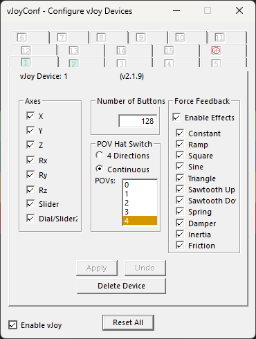
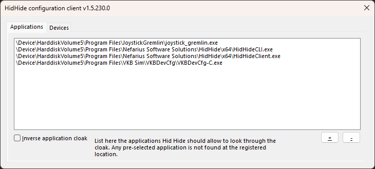
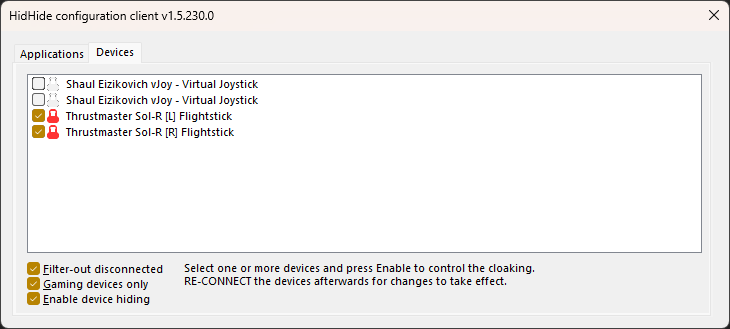

# Enhanced Binds Frequently Asked Questions

## Enhanced Binds Checklist

Installing the Enhanced binds is very simple but due to game bugs or slight user error, there can be some snags. Here are some common places users get snagged.

1. Make sure your physical joysticks match mine. The README section for your specific setup will say if you need to make changes. This usually means going through the manufacturer software to calibrate and align the same physical button layout (if your controls are interchangeable). I only change joystick configs when I absolutely have to, to keep things as plug-and-play as possible.

    !!! example
        Make sure your Gladiator NXTs have been properly set up. Players commonly skip setup after assembly. Here is the latest [VKB video at the software setup timestamp](https://youtu.be/HRC5uPpFPzk?si=POKljkenaIM9mxpF&t=487). If this wasn't done, your physical button mappings may not match.

2. You may want to update your firmware, but that is usually optional. I’ll specify in your setup README if this is required.

3. Make sure your HIDHide and vJoy settings look exactly like the images below (whitelisting JG, HIDHide, and VKBDev; hiding all but the virtual sticks; and having a second vJoy device with all the same params except button count). You can compare against [vJoy Configuration](../general-setup/software-configuration.md#vjoy-configuration){ data-preview } and [HIDHide Configuration](../general-setup/software-configuration.md#applications-allow-list){ data-preview }.

    === "First vJoy Device"
        { width="380" }

    === "Second vJoy Device"
        { width="380" }

    === "HIDHide Applications"
        

    === "HIDHide Devices"
        

4. Ensure you are loading the correct Joystick Gremlin profile for your setup. i.e. `Joystick Gremlin Profile [ENH][STICK_COMBO][X.Y.Z].xml` (for example: `Joystick Gremlin Profile [ENH][NXT][4.5.0].xml`).

5. Make sure you [Swap Devices](#i-loaded-your-profile-but-its-empty-or-there-are-no-mappings) in Joystick Gremlin.

6. Optional: delete the`actionmaps.xml` file inside`Profiles` folder at `C:\Program Files\Roberts Space Industries\StarCitizen\LIVE\USER\Client\0\Profiles`

    ??? tip "Pro Tip"
        That file houses the current binds SC has loaded, inversion settings, etc. Basically all the settings you can change inside SC for keybinds. 

7. Put your setup-specific `layout_*_exported.xml` file (for example: `layout_ENH_450_NXT_exported.xml`) and `layout_SUB_Clear_Bindings_4xx_exported.xml` into `Roberts Space Industries\StarCitizen\LIVE\USER\Client\0\Controls\Mappings`

8. Make sure the JG profile is on (🎮  icon should be blue). This must be done every time JG starts, unless you enable auto-load/auto-start in settings.

9. You must [properly clear bindings](general-joystick-star-citizen-faq.md#how-to-properly-clear-bindings){ data-preview }. There are many ways to do this, and the linked section explains the quickest reliable method.

10. Launch SC and load your setup-specific `layout_*_exported.xml` SC binding file (for example: `layout_ENH_450_NXT_exported.xml`). 

11. Check inside "Flight movement" and make sure all six axes are bound. If some of the axes are missing, clear and rebind again. (SC can be jank...)

12. Axis inverted? See the [Inverted Throggle](general-joystick-star-citizen-faq.md#my-throttlerollany-axis-is-inverted){ data-preview }

## I loaded your profile but it's empty or there are no mappings

That's intended, not broken. The profile ships against the device GUIDs of the sticks I exported on, so your hardware needs to be matched in before binds appear.

In Joystick Gremlin, open **Tools → Swap Devices**. You'll see your physical devices on the left, and what devices they're assigned to on the right. Contrary to its name, you aren't necessarily "swapping" devices; you are syncing them. Press the white box to the right of your first physical stick, then move an axis on that stick. Then **STOP** and double-check that the physical sticks didn't reorder themselves. If they did, redo the first device, and possibly the second.

**Save the profile afterwards** by clicking the Save icon in the toolbar — the page with a down arrow on it. Ctrl+S won't do anything in JG; the toolbar icon is the only save. Without the save, every time JG starts you'll be back to a blank-looking profile and have to redo this.

!!! example "Explanation"
    What you just did replaced my device IDs with your own and synced the vJoy devices to the correct sticks.

## I am getting a vJoy error

There are a few things that can cause vJoy errors:

- You did not restart your PC after making a change to a vJoy device.
- Your vJoy settings don't EXACTLY match what I showed in the installation video. Each vJoy device should have all axes enabled, POV Hat Switch set to Continuous, and 4 POVs. Your first device should have 128 buttons and the second 127.
- You do not have 2 vJoy devices set up.

### Explanation

We have to change something on the second vJoy device because two vJoy devices cannot have an identical config, and your vJoy settings need to match mine EXACTLY for JG to not error out.

!!! note
   Having 2 vJoy devices may require entering `pp_resortdevices joystick 1 2` in the Star Citizen console, but you should only need to do this once, and never again unless you reset your SC settings.

## Only one stick works in Star Citizen

If one of your sticks isn't working in SC, that usually means SC is seeing more than the 2 vJoy devices. In most cases, your HIDHide settings don't match the ones shown in [vJoy - Software Configuration](../general-setup/software-configuration.md#vjoy-configuration){ data-preview }

## Star Citizen/JG Input Viewer does not register any actions

- First check Input Viewer to see if your `virtual` sticks are firing.
- If they are not, turn on the profile. *It's ok, it happens to the best of us 🤣*

## I press a button and JG keeps pressing that button

`Input Repeater` and `Input Viewer` look similar andyou probably accidentally cliked the wrong one.

!!! tip
	Turn off "Input Repeater".

## How to add TTS dialogue when I switch between Master Modes

Adding Text to Speech to a button is simple. Inside you stick gremlin:

1. Select physical button 3 for example. This will open up a view of the actions.
2. Add a TTS (Text to Speech) action beneith the already added remap.
3. Type in the desired phrase or word (for example: Auxiliary Mode Enabled).
4. Turn the profile off and then back on.
5. Repeat for each stick in Auxiliary, Nav, and SCM modes.

## How to get JG to play a sound when I switch between Master Modes

Adding an audio clip to a button is simple:

1. Select physical button 3 for example. This will open up a view of the actions.
2. There is usually a TTS action added here by default. You should delete this or risk hearing both TTS and the audio file.
3. Click the pencil icon and point it to where the audio file is located on your hard drive. *Make sure you don't have them saved to a location like your desktop or downloads folder that you may delete later.*
4. Repeat for each stick in Auxiliary, Nav, and SCM modes.
5. Turn the profile off and then back on.

??? tip "Save As, Pro Tip"
    It's a good practice to `Save As` whenever you make a change to my default config. That way if you break something you have it to fall back on. Also if you're doing lots of changes it's a good best practice to `Save As` occasionally in case you break something after spending an evening getting it just right. Since you can't *undo* your change if you corrupt a JG profile, you'll need to fix the syntax manually — that's a pain. Ask me how I know...

## Can I add Rudder Pedals, a Button Box, or an SEM to the Enhanced Binds?

Absolutely — pedals, button boxes, an SEM module on your stick, any extra HID device all follow the same flow, and if the game is already open you don't need to restart it. The core idea: the profile only uses part of what the two vJoy devices offer (16 axes, 255 buttons), so there's plenty of headroom — you map each new physical input to an **unused** vJoy slot, then bind that vJoy input in SC.

One thing changed in JG R14 from older versions of Gremlin: it **no longer auto-picks the next available vJoy slot** when you add a Map to vJoy action. You have to choose a free vJoy axis (or button) explicitly. Here's the flow:

**Step 1. Plug in your rudder pedals (or button box).** Joystick Gremlin picks the device up and adds a tab for it along the top.

**Step 2. Figure out which vJoy slot is free.** Easiest way:

* Open **Tools → Input Viewer** in JG with the Enhanced profile **activated**.
* In the device list on the left, tick the box for **vJoy Device 1** (and Device 2 if you want to see both). vJoy shows up alongside your physical devices.
* Move every physical input you currently have bound — sticks, throttle, hats, etc.
* Watch the vJoy axis indicators. Any axis that **never moves** while you exercise every existing binding is unused — that's a free slot you can grab. Same for vJoy buttons: any that don't light up are free.
* The shipped profiles only output to **vJoy 1** and **vJoy 2**. They never use vJoy 3 or higher, so if you have those configured in vJoy Setup you can also just pick any axis on those without checking.

If the Input Viewer feels fussy, the Windows control-panel shortcut **`joy.cpl`** (run from Start menu or Win+R) shows the same thing — pick `vJoy Device` from the dropdown and watch the axis bars while you wiggle everything you already have bound. Unmoved bars = unused.

**Step 3. Map the rudder axis to the free vJoy slot you found.** Click the rudder's device tab in JG, click the axis (usually labeled `X Axis` or similar on the left), then add a **Map to vJoy** action. In the action's dropdowns, set vJoy Device + Input ID to the free slot you identified in Step 2.

**Step 4. Cycle the profile.** Click the blue Activate icon to turn the profile off, then click it again to turn it back on. Then **save the profile** by clicking the Save icon in the toolbar (the page with a down arrow on it — Ctrl+S doesn't work in JG).

**Step 5. Tell SC about the new axis.** Launch Star Citizen → **Options → Keybindings → Advanced Controls Customization → Flight Movement**. Find Roll or Yaw (whichever you're moving to the pedals — depends on which team you're on 😅), clear the existing joystick binding, then add a new one and move the rudder. SC captures the input. Save the keybind profile before exiting.

For a button box or an SEM, the flow is identical — just substitute "free vJoy button" for "free vJoy axis" in Step 2 (Input Viewer shows buttons in the same panel as axes) and "Map to vJoy" set to a button input ID in Step 3. An SEM shows up as extra buttons/axes on the stick it's attached to rather than as its own device tab, but the mapping steps don't change. You can also *duplicate* an existing bind instead of adding a new one — point the new physical button at the same vJoy button an existing input already uses, and both will fire the same action.

??? tip "Save As, Pro Tip"
    It's a good practice to `Save As` whenever you make a change to my default config. That way if you break something you have it to fall back on. Also if you're doing lots of changes it's a good best practice to `Save As` occasionally in case you break something after spending an evening getting it just right. Since you can't *undo* your change if you corrupt a JG profile, you'll need to fix the syntax manually — that's a pain. Ask me how I know...

## Video Guides

### Loading Joystick Gremlin Bindings into Star Citizen

Step-by-step walkthrough for loading Joystick Gremlin and Star Citizen profiles (timestamp starts at the profile-loading portion).

<iframe width="100%" height="450" src="https://www.youtube.com/embed/mc-ozIogrpI?start=498" title="Loading Joystick Gremlin Bindings into Star Citizen" frameborder="0" allow="accelerometer; autoplay; clipboard-write; encrypted-media; gyroscope; picture-in-picture; web-share" referrerpolicy="strict-origin-when-cross-origin" allowfullscreen></iframe>

