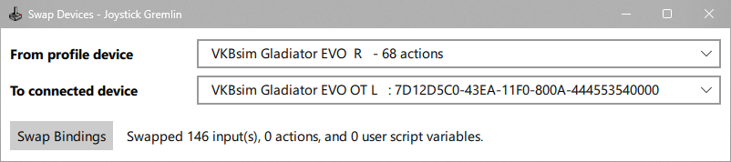
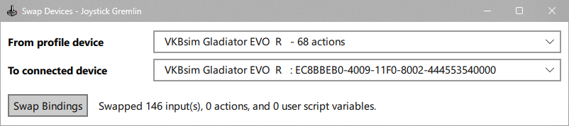
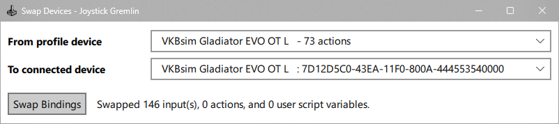

# Software Configuration

If your software is already installed, start here. This page provides the exact settings for each program used with curated binds.

!!! note
	You should also consult the README for your specific joystick setup, since some combinations require slight changes.

## vJoy Configuration

- Open `vJoy Configuration`
- First vJoy Device: check all axes, set `128` buttons, `Continuous` POV mode, and `4` POV hats.
- Second vJoy Device: check all axes, set `127` buttons, `Continuous` POV mode, and `4` POV hats.
- Apply changes and close the tool before loading Joystick Gremlin.

=== "First vJoy Device"
    { width="380" }

=== "Second vJoy Device"
    { width="380" }

!!! warning
    - You will almost certainly need to restart windows after making changes here.
	- Two vJoy devices are needed for most joystick profiles due to the 8-axis-per-device limitation.
	- Because Joystick Gremlin handles output mapping, you usually should not need to run `pp_resortdevices joystick 1 2` repeatedly.
    - If Star Citizen detects more than two vJoy devices, users commonly run into sorting headaches. If you are adding rudder pedals on top of the config there should be enough axis between the two vjoys.

## HIDHide Configuration

### Applications (Allow-List)

This list controls which programs are allowed to see physical devices.

- Confirm `HIDHide Configuration Client` is present (normally default)
- Add `joystick_gremlin.exe`
- Add manufacturer software that needs direct hardware visibility (for example: VKBDevCfg, Virpil software, Thrustmaster TARGET, MOZA tools)

!!! warning
    Do **not** add Star Citizen to this allow-list.
    Star Citizen must not see physical sticks directly when using curated vJoy-based binds.

*Screenshot coming soon.*

### Devices

This is where we blacklist all physical devices that might interfere with SC.

- Hide physical joystick and throttle devices
- Hide non-joystick HID devices that may inject game input (for example: gamepads, Razer Tartarus, keyboards with optical/analog switches)
- Do **not** hide vJoy devices
- Enable Device Hiding only after the allow-list is complete

!!! warning
    Common breakpoints:
    - Enabling HIDHide before adding required applications
    - Leaving gamepads/keypads/analog keyboards unhidden
    - Adding Star Citizen to the allow-list

!!! important "Re-plug your sticks after enabling Device Hiding"
    HIDHide only starts cloaking a device the **next time Windows enumerates it.** After the allow-list is done and **Enable Device Hiding** is ticked, **unplug your joysticks and plug them back in** (or reboot). Until you do, Star Citizen can still see the raw physical sticks — doubled inputs / wrong axes — even though HIDHide is configured correctly. This is a frequent "I did everything right but it's still broken" snag.

## Joystick Gremlin Configuration

1. Open Joystick Gremlin (R14.x — 14.3 or newer; R13 is no longer supported).
2. Load the Joystick Gremlin profile from your stick's folder. The filename starts with `Joystick Gremlin Profile` and ends in `[R14].xml`. (The other `.xml` files in the folder — the `layout_ENH_*_exported.xml` ones — are for Star Citizen's keybind menu, not JG; don't pick them here.)
3. Run **Tools → Swap Devices** to re-point the profile's bindings onto your physically connected hardware. The dialog has two dropdowns: **From profile device** (the device the profile was authored on) on top, and **To connected device** (the matching stick you have plugged in) below. Pick the pair, click **Swap Bindings**, and JG reports how many inputs it moved. Repeat once per stick — one swap for each physical device.

    === "Swap step 1"
        

    === "Swap step 2"
        

    === "Swap step 3"
        

    **Save the profile** afterwards by clicking the Save icon in the toolbar — the page with a down arrow on it. Ctrl+S doesn't work in JG; the toolbar icon is the only save. Without the save you'll redo this every time JG starts.
4. Verify each physical input resolves to the expected virtual output in JG's `Input Viewer`.
5. Activate the profile by clicking the **joystick icon** in the toolbar ( <svg width="14" height="14" viewBox="0 0 16 16" fill="currentColor" style="vertical-align:text-bottom"><path d="M10 2a2 2 0 0 1-1.5 1.937v5.087c.863.083 1.5.377 1.5.726 0 .414-.895.75-2 .75s-2-.336-2-.75c0-.35.637-.643 1.5-.726V3.937A2 2 0 1 1 10 2"/><path d="M0 9.665v1.717a1 1 0 0 0 .553.894l6.553 3.277a2 2 0 0 0 1.788 0l6.553-3.277a1 1 0 0 0 .553-.894V9.665c0-.1-.06-.19-.152-.23L9.5 6.715v.993l5.227 2.178a.125.125 0 0 1 .001.23l-5.94 2.546a2 2 0 0 1-1.576 0l-5.94-2.546a.125.125 0 0 1 .001-.23L6.5 7.708l-.013-.988L.152 9.435a.25.25 0 0 0-.152.23"/></svg> ). It turns **blue** when the profile is live. If your axes don't move in the Input Viewer, it's off.

!!! note
    Run Joystick Gremlin with the same privilege level each launch to avoid inconsistent behavior.

## Quick Validation Before Launching Star Citizen

1. `joy.cpl` (USB Game Controllers) shows the expected vJoy devices and no physical devices
2. Open Joystick Gremlin `Input Viewer`, check `buttons` and `axis` for both vJoy devices, then move physical controls while the profile is active to verify output.

## Next Step

Only after those checks pass, Continue with [Star Citizen Setup](star-citizen-setup.md){ data-preview }.